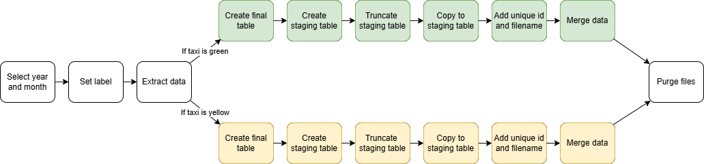

# Understanding Workflow Orchestration with Kestra

## Table of Contents
- [What is Orchestration?](#what_is_orchestration?)
- [What is Kestra?](#what_is_kestra?)
- [Building a Simple Workflow in Kestra](#building_a_simple_workflow_in_kestra)
- [Defining Inputs and Execution Parameters](#defining_inputs_and_execution_parameters)
- [Task Execution Flow](#task_execution_flow)
- [Execution](#execution)
- [ETL Pipelines with Postgres](#etl_pipelines_with_postgres)
- [Defining ETL Tasks](#defining_etl_tasks)
- [Using Variables for Dynamic Naming](#using_variables_for_dynamic_naming)
- [Extracting the Data](#extracting_the_data)
- [Setting Up a PostgreSQL Database with Docker](#setting_up_a_postgresql_database_with_docker)
- [Creating Tables and Managing Data](#creating_tables_and_managing_data)
- [Manage Scheduling and Backfills with Postgres](#manage_scheduling_and_backfills_with_postgres)





## What is Orchestration?

Before diving into workflow orchestration, let’s first define what orchestration actually means. A useful analogy is that of a musical orchestra. In an orchestra, various instruments—violins, trumpets, flutes—each produce distinct sounds and must be played at precise moments. Some instruments play simultaneously, while others come in at different times, all guided by a conductor ensuring harmony.

Similarly, in the context of Python, we often have multiple scripts performing different tasks. Running these scripts independently is only part of the challenge. The real complexity lies in coordinating them—ensuring they can communicate, share data, and function in a structured manner. Effective orchestration ensures that your scripts work together seamlessly while providing visibility into their execution, making it easier for you, the user, to manage complex workflows.

## What is Kestra?

Kestra is a comprehensive automation and orchestration platform designed to streamline workflow execution. It enables you to build and manage **ETL pipelines**, schedule workflows for periodic execution, or trigger them dynamically based on events—such as new data arrivals. Essentially, Kestra automates the execution of data pipelines, eliminating the need for manual intervention.

One of Kestra’s standout features is its flexibility. It accommodates different levels of technical expertise by offering **no-code, low-code, and full-code** options for workflow creation. Even when using full-code solutions, Kestra provides intuitive visualizations, helping you understand how different stages of a workflow are structured and interconnected.

Beyond execution, Kestra offers robust **monitoring and logging** capabilities, allowing you to track the progress of tasks, inspect generated logs, and verify whether scheduled workflows have executed successfully. Additionally, Kestra integrates with over **600 plugins**, supporting popular data tools such as **Databricks, Snowflake, and dbt,** making it a powerful choice for orchestrating complex pipelines.

## Building a Simple Workflow in Kestra

Let’s examine a basic pipeline that **extracts, transforms, and queries** data.

Each workflow in Kestra is structured using an **ID** and a **namespace**, which help in organizing workflows efficiently. The ID uniquely identifies a workflow, while the namespace functions like a directory where related workflows are stored. In this example, we use the namespace `farhad_mustafayev_kestra_proj` to categorize our flows.


```bash
id: getting_started_data_pipeline
namespace: farhad_mustafayev_kestra_proj

inputs:
  - id: columns_to_keep
    type: ARRAY
    itemType: STRING
    defaults:
      - brand
      - price

tasks:
  - id: extract
    type: io.kestra.plugin.core.http.Download
    uri: https://dummyjson.com/products

  - id: transform
    type: io.kestra.plugin.scripts.python.Script
    containerImage: python:3.11-alpine
    inputFiles:
      data.json: "{{outputs.extract.uri}}"
    outputFiles:
      - "*.json"
    env:
      COLUMNS_TO_KEEP: "{{inputs.columns_to_keep}}"
    script: |
      import json
      import os

      columns_to_keep_str = os.getenv("COLUMNS_TO_KEEP")
      columns_to_keep = json.loads(columns_to_keep_str)

      with open("data.json", "r") as file:
          data = json.load(file)

      filtered_data = [
          {column: product.get(column, "N/A") for column in columns_to_keep}
          for product in data["products"]
      ]

      with open("products.json", "w") as file:
          json.dump(filtered_data, file, indent=4)

  - id: query
    type: io.kestra.plugin.jdbc.duckdb.Query
    inputFiles:
      products.json: "{{outputs.transform.outputFiles['products.json']}}"
    sql: |
      INSTALL json;
      LOAD json;
      SELECT brand, round(avg(price), 2) as avg_price
      FROM read_json_auto('{{workingDir}}/products.json')
      GROUP BY brand
      ORDER BY avg_price DESC;
    fetchType: STORE
```

## Defining Inputs and Execution Parameters

The workflow accepts **input parameters**, which allow us to define execution-specific settings. For instance, the workflow defaults to two parameters: `brand` and `price`. However, these values can be modified during execution to tailor the results dynamically.

## Task Execution Flow

The workflow consists of a series of tasks, each serving a distinct purpose:
1.	**Extracting Data** – The first task retrieves data from dummyjson.com.
2.	**Transforming Data** – A Python script processes the extracted data. This script can be embedded directly within the workflow or referenced from an external file using the **"commands task"**. The extracted data is passed as an input file from the first task to the next for processing.
3.	**Generating Output Files** – The transformed data is saved as "products.json", which is then used in subsequent tasks.
4.	**Querying Data** – The workflow refines the processed data by applying specific queries, yielding a structured output.

## Execution

When executing the workflow, Kestra provides a Gantt chart visualization, illustrating the sequence and execution status of each task. Clicking on a task reveals detailed log messages, offering insights into its execution.

Navigating to the **“Outputs”** tab, we can inspect the results generated at different stages. The Python script produces multiple files, such as "products.json" and "data.json", which can then be utilized in subsequent tasks. Finally, the query task presents the data in a structured table format, which can be downloaded or forwarded to another task, such as uploading to the cloud.


# ETL Pipelines with Postgres

In this section, I will guide you through the process of setting up ETL pipeline using **Kestra** and **PostgreSQL**. Afterwards, we'll look at how we can add a schedule and back fills.

We have a wealth of available data on New York taxis, including both yellow taxi and green taxi datasets. Our objective is to explore this data, perform various transformations using Kestra, and ultimately load it into a database.

This dataset is structured by month, meaning new data becomes available every month. We currently have data covering all of 2019 and 2020, as well as up to July 2021. Given this, we can design a workflow that processes the new data each month and appends it to a consolidated table, eliminating the need for manual downloads. To facilitate this, I have created a workflow named `postgres_taxi` within the `farhad_mustafayev_kestra_proj` namespace.


```bash
id: postgres_taxi
namespace: farhad_mustafayev_kestra_proj
```


## Defining ETL Tasks

To build our ETL pipeline, we need to define several tasks:
1.	**Extracting the Data**
    -	We will fetch data from a GitHub repository by making an HTTP request.
2.	**Transforming the Data**
    -	The extracted data will be merged into a unified table that contains all the monthly records.
3.	**Loading the Data into PostgreSQL**
    -	The data will first be inserted into a staging table, which will then be merged into the main table.

To allow dynamic selection of data subsets, we introduce input parameters:
-	A drop-down menu to choose between yellow and green taxis, defaulting to yellow.
-	Additional drop-downs for selecting the year and month.

```bash
inputs:
  - id: taxi
    type: SELECT
    displayName: Select taxi type
    values: [yellow, green]
    defaults: yellow

  - id: year
    type: SELECT
    displayName: Select year
    values: ["2019", "2020"]
    defaults: "2019"

  - id: month
    type: SELECT
    displayName: Select month
    values: ["01", "02", "03", "04", "05", "06", "07", "08", "09", "10", "11", "12"]
    defaults: "01"
```

## Using Variables for Dynamic Naming

Since filenames and table names will vary based on input values, we define dynamically generated **variables**.


```bash
variables:
  file: "{{inputs.taxi}}_tripdata_{{inputs.year}}-{{inputs.month}}.csv"
  staging_table: "public.{{inputs.taxi}}_tripdata_staging"
  table: "public.{{inputs.taxi}}_tripdata"
  data: "{{outputs.extract.outputFiles[inputs.taxi ~ '_tripdata_' ~ inputs.year ~ '-' ~ inputs.month ~ '.csv']}}"
```


- **file** – The filename to be downloaded.
- **staging_table** – The table where monthly data is initially loaded.
- **table** – The main consolidated table containing all data.
- **data** – The extracted dataset, derived from an ETL task output.


I've also added a quick `set label` task here just to be able to help us identify if this is a green taxi or a yellow taxi execution:

```bash
tasks:
  - id: set_label
    type: io.kestra.plugin.core.execution.Labels
    labels:
      file: "{{render(vars.file)}}"
      taxi: "{{inputs.taxi}}"
```

## Extracting the Data

To extract the dataset, we define an **"extract task"** that utilizes the wget command to download the data file from GitHub. The data is compressed in GZ format, so we must decompress it to obtain a usable CSV file.

```bash
  - id: extract
    type: io.kestra.plugin.scripts.shell.Commands
    outputFiles:
      - "*.csv"
    taskRunner:
      type: io.kestra.plugin.core.runner.Process
    commands:
      - wget -qO- https://github.com/DataTalksClub/nyc-tlc-data/releases/download/{{inputs.taxi}}/{{render(vars.file)}}.gz | gunzip > {{render(vars.file)}}
```

For instance, if we select green taxi data from January 2019 and execute the workflow, we can verify the extracted data under the **"Output"** tab.

## Setting Up a PostgreSQL Database with Docker

Since Kestra itself runs on a PostgreSQL database, we could use that, but for demonstration purposes, I will show you how to quickly deploy a dedicated PostgreSQL instance using Docker. I have created a **Docker Compose** file defining a PostgreSQL service:

```bash
version: "3.8"
services:
  postgres:
    image: postgres
    container_name: postgres-db
    environment:
      POSTGRES_USER: farhad
      POSTGRES_PASSWORD: k3str4
      POSTGRES_DB: postgres-farhad
    ports:
      - "5432:5432"
    volumes:
      - postgres-data:/var/lib/postgresql/data
volumes:
  postgres-data:
```

- Container Name: postgres_DB
- Database Name: postgres-farhad
- Default Port: 5432
- Credentials: Predefined username and password

By executing `docker-compose up`, we can launch the database, enabling Kestra to read and write data.


## Creating Tables and Managing Data

To store our processed data, we define a **SQL query task** that ensures tables exist before inserting data. Each table name is dynamically generated using variable expressions.

For the green dataset, I can now introduce a PostgreSQL query task that ensures the necessary tables exist before proceeding. Specifically, if the target table does not already exist, we will create it. The table name follows the format `var.table`, where `var.table` represents `public`, and the dataset corresponds to the taxi color `green_tripdata` in this case. Thus, the primary table consolidating all data will be named after the taxi color, suffixed with `_tripdata`, while the staging table will append `_staging` to this name.

```bash
      - id: green_create_table
        type: io.kestra.plugin.jdbc.postgresql.Queries
        sql: |
          CREATE TABLE IF NOT EXISTS {{render(vars.table)}} (
              unique_row_id          text,
              filename               text,
              VendorID               text,
              lpep_pickup_datetime   timestamp,
              lpep_dropoff_datetime  timestamp,
              store_and_fwd_flag     text,
              RatecodeID             text,
              PULocationID           text,
              DOLocationID           text,
              passenger_count        integer,
              trip_distance          double precision,
              fare_amount            double precision,
              extra                  double precision,
              mta_tax                double precision,
              tip_amount             double precision,
              tolls_amount           double precision,
              ehail_fee              double precision,
              improvement_surcharge  double precision,
              total_amount           double precision,
              payment_type           integer,
              trip_type              integer,
              congestion_surcharge   double precision
          );
```

To dynamically construct these table names, we utilize the `render` function within the expression. This function is essential because it allows us to evaluate a variable containing an expression, ensuring that it resolves into a meaningful string (e.g., "green" or "yellow"). Without explicitly rendering the variable, it would remain a static string, lacking the desired dynamic content. This approach is particularly crucial when dealing with recursive expressions—where an expression references another string that itself contains an expression. Ensuring explicit rendering guarantees that all components are properly evaluated.

The SQL query structure closely resembles the dataset but includes two additional columns: `unique_row_ID` and `filename`. These additions allow us to track the data source and prevent duplicate entries. The `unique_row_ID` is generated using an MD5 hash based on the row’s data, ensuring a consistent and deterministic identifier. This mechanism helps prevent duplicate insertions if the same dataset is processed multiple times. However, if certain records are missing in the existing data, they will still be added since their corresponding MD5 hashes will not exist in the table.

To execute this SQL task, we need a database connection URL and authentication details. Since multiple queries will be executed, we employ plugin defaults to set parameters such as the URL, username, and password globally for all PostgreSQL tasks, eliminating the need to repeatedly copy and paste these values. This approach enhances maintainability, especially when switching databases, as updates only need to be made in a single location. I have incorporated these plugin defaults within the PostgreSQL plugin configuration.

```bash
pluginDefaults:
  - type: io.kestra.plugin.jdbc.postgresql
    values:
      url: jdbc:postgresql://host.docker.internal:5432/postgres-farhad
      username: farhad
      password: k3str4
```

Given that the process is containerized within Docker, I use `host.docker.internal` as the hostname, allowing Kestra (also running in Docker) to communicate with the database. The PostgreSQL server is accessible via port `5432`, with credentials retrieved from the docker-compose file.

Since the yellow taxi dataset contains slightly different columns, a separate task must be created for it. However, before doing so, we will complete the entire process for the green dataset. Later, we can incorporate conditional logic to ensure the appropriate workflow executes based on the dataset type.

With the table creation step completed, the next requirement is a **staging table**. This table temporarily holds data from the CSV files before merging them into the main table. Additionally, it facilitates the inclusion of extra columns (`unique_row_ID` and `filename`), which are not present in the original dataset. Thus, the next step is to define a task that creates this staging table and loads the CSV data into it.

```bash
      - id: green_create_staging_table
        type: io.kestra.plugin.jdbc.postgresql.Queries
        sql: |
          CREATE TABLE IF NOT EXISTS {{render(vars.staging_table)}} (
              unique_row_id          text,
              filename               text,
              VendorID               text,
              lpep_pickup_datetime   timestamp,
              lpep_dropoff_datetime  timestamp,
              store_and_fwd_flag     text,
              RatecodeID             text,
              PULocationID           text,
              DOLocationID           text,
              passenger_count        integer,
              trip_distance          double precision,
              fare_amount            double precision,
              extra                  double precision,
              mta_tax                double precision,
              tip_amount             double precision,
              tolls_amount           double precision,
              ehail_fee              double precision,
              improvement_surcharge  double precision,
              total_amount           double precision,
              payment_type           integer,
              trip_type              integer,
              congestion_surcharge   double precision
          );
```

The staging table structure closely mirrors that of the main table. However, it is truncated before each new data insertion, ensuring that it holds only the current batch of records. Unlike dropping a table, truncation removes only the data while retaining the table definition, allowing for efficient reuse across multiple executions.

To validate the process, I can execute the workflow and inspect the database using **PGAdmin** or **pgcli**. For instance, executing this workflow for the green taxi dataset from January 2019 will create both `green_tripdata` and `green_tripdata_staging` tables. Re-running the workflow with the same dataset will then transfer data into these tables. At this stage, however, the `unique_row_ID` and `filename` columns remain NULL since their values have not yet been assigned.
For data ingestion, we leverage the **copyIn** task within Kestra. 

```bash
      - id: green_copy_in_to_staging_table
        type: io.kestra.plugin.jdbc.postgresql.CopyIn
        format: CSV
        from: "{{render(vars.data)}}"
        table: "{{render(vars.staging_table)}}"
        header: true
        columns: [VendorID,lpep_pickup_datetime,lpep_dropoff_datetime,store_and_fwd_flag,RatecodeID,PULocationID,DOLocationID,passenger_count,trip_distance,fare_amount,extra,mta_tax,tip_amount,tolls_amount,ehail_fee,improvement_surcharge,total_amount,payment_type,trip_type,congestion_surcharge]
```

This task extracts data from the data variable, which itself is an expression containing additional metadata. Since data is an evaluated output, it must be rendered explicitly into a string format to correctly reference the name of the generated output file. Additionally, we define the specific columns that will receive the incoming data. Notably, `unique_row_ID` and `filename` are initially left as NULL because they are not yet populated during the copying process.

```bash
      - id: green_add_unique_id_and_filename
        type: io.kestra.plugin.jdbc.postgresql.Queries
        sql: |
          UPDATE {{render(vars.staging_table)}}
          SET 
            unique_row_id = md5(
              COALESCE(CAST(VendorID AS text), '') ||
              COALESCE(CAST(lpep_pickup_datetime AS text), '') || 
              COALESCE(CAST(lpep_dropoff_datetime AS text), '') || 
              COALESCE(PULocationID, '') || 
              COALESCE(DOLocationID, '') || 
              COALESCE(CAST(fare_amount AS text), '') || 
              COALESCE(CAST(trip_distance AS text), '')      
            ),
            filename = '{{render(vars.file)}}';
```
The next step is to populate these additional columns by updating the staging table. Since the columns already exist, no schema modifications are necessary. Using an `UPDATE` query, we set `unique_row_ID` as an MD5 hash computed from multiple fields within the row. This ensures that, even if the same dataset is processed multiple times, identical rows receive consistent `unique_row_ID` values. This deterministic approach prevents unintentional duplicates, unlike a randomly generated identifier, which would produce different values for each execution.

Similarly, `filename` is assigned using the rendered variable, ensuring proper evaluation of expressions embedded within it. Once these updates are applied, re-executing the workflow for the green dataset will now yield a fully populated table with `unique_row_ID` and `filename` values.

Before inserting data into the final table, it is crucial to truncate the staging table. This step clears all records while preserving the table structure, preventing old data from interfering with new batches. Importantly, the main table is never truncated, ensuring that previously merged data remains intact. Instead, the merging process selectively inserts only new records based on their unique identifiers.

```bash
      - id: green_truncate_staging_table
        type: io.kestra.plugin.jdbc.postgresql.Queries
        sql: |
          TRUNCATE TABLE {{render(vars.staging_table)}};
```

Re-executing the workflow at this stage will demonstrate the truncation effect—removing all rows from the staging table while preserving the unique identifiers for new data insertions. After copying and updating the data, a verification step in **PGAdmin** will confirm that the row count remains consistent, ensuring no duplicate records.

The final step is to merge the staging table into the main table to build a comprehensive dataset. This is achieved using a MERGE operation.

```bash
      - id: green_merge_data
        type: io.kestra.plugin.jdbc.postgresql.Queries
        sql: |
          MERGE INTO {{render(vars.table)}} AS T
          USING {{render(vars.staging_table)}} AS S
          ON T.unique_row_id = S.unique_row_id
          WHEN NOT MATCHED THEN
            INSERT (
              unique_row_id, filename, VendorID, lpep_pickup_datetime, lpep_dropoff_datetime,
              store_and_fwd_flag, RatecodeID, PULocationID, DOLocationID, passenger_count,
              trip_distance, fare_amount, extra, mta_tax, tip_amount, tolls_amount, ehail_fee,
              improvement_surcharge, total_amount, payment_type, trip_type, congestion_surcharge
            )
            VALUES (
              S.unique_row_id, S.filename, S.VendorID, S.lpep_pickup_datetime, S.lpep_dropoff_datetime,
              S.store_and_fwd_flag, S.RatecodeID, S.PULocationID, S.DOLocationID, S.passenger_count,
              S.trip_distance, S.fare_amount, S.extra, S.mta_tax, S.tip_amount, S.tolls_amount, S.ehail_fee,
              S.improvement_surcharge, S.total_amount, S.payment_type, S.trip_type, S.congestion_surcharge
            );
```

-	The main table is referenced as T.
-	The staging table is referenced as S.
-	Records are inserted only if `T.unique_row_ID` does not match any existing `S.unique_row_ID`.
-	If a match is found, the duplicate record is ignored.

This ensures that reprocessing a dataset (e.g., rerunning January's data multiple times) does not lead to redundant entries. Instead, only genuinely new records are added. The `MERGE` operation also explicitly selects only the necessary columns from the staging table, ensuring data consistency.

Executing this workflow for the green dataset will now result in data appearing in both the staging and main tables. Previously, the main table was empty, but after execution, it contains the transformed dataset. Running the workflow again for February will demonstrate the dynamic nature of the process—first truncating the staging table, then ingesting the new month's data, and finally merging it into the main table alongside January’s records. Since the two months have different data, their MD5 hashes will be distinct, preventing any conflicts.


Thus far, we have:
1.	Extracted data from GitHub.
2.	Loaded it into a staging table, adding `unique_row_ID` and `filename` as extra columns.
3.	Merged the data into the main table, consolidating records into a single comprehensive dataset.

The next step is to replicate this workflow for the yellow dataset while introducing conditional logic to determine the appropriate execution path based on user input.
Additionally, to optimize storage, we must introduce a purging mechanism. Each time the workflow runs, it downloads the dataset anew, gradually consuming disk space. To mitigate this, we should implement a purge execution output files task, ensuring that unnecessary temporary files are removed post-execution.

```bash
  - id: purge_files
    type: io.kestra.plugin.core.storage.PurgeCurrentExecutionFiles
    description: This will remove output files. If you'd like to explore Kestra outputs, disable it.
```

The system is designed to purge the current execution files, effectively removing them before the execution process is completed. If you wish to retain these files, you can disable this task effortlessly by adding the property `disabled` and setting it to `true`. However, in my scenario, I will leave this setting unchanged, as I intend for the system to perform the purge.

Now that we are prepared to proceed with the yellow dataset, there are multiple approaches we could take. One option is to navigate to the `task` section and add a `runif` property beneath the `type`. However, this approach requires manually adding the property to every task, which quickly becomes cumbersome. Instead, we will implement a conditional `if` statement, grouping all the green tasks together and applying the same logic to the yellow dataset. This ensures that all tasks related to the yellow dataset are executed collectively, just as those for the green dataset are grouped.

To achieve this, we will define an `ID` and utilize the `flow.if` task, where I have simply set the condition to "green". With this structure in place, we can proceed to add an "if yellow" condition, replicating the necessary tasks but modifying them to accommodate the yellow dataset.

```bash
  - id: if_yellow_taxi
    type: io.kestra.plugin.core.flow.If
    condition: "{{inputs.taxi == 'yellow'}}"
    then:

    - id: if_green_taxi
    type: io.kestra.plugin.core.flow.If
    condition: "{{inputs.taxi == 'green'}}"
    then:
```

Key Achievements:
-	We have structured multiple input parameters, allowing us to specify the dataset, year, and month dynamically.
-	These parameters facilitate the generation of variables, which themselves contain expressions that enable dynamic variable creation. This eliminates the need for hardcoding values throughout the workflow.
-	The workflow leverages four key variables— `file`, `staging_table`, `table`, and `data`—which streamline the process and maintain clarity. By utilizing this dynamic approach, we avoid hardcoding file and dataset names, ensuring flexibility as they change.
-	Additionally, we create a label to track execution logs, making it easy to identify which task has been executed.
-	Data extraction is handled by sending a request to GitHub using `WGet`, followed by unzipping the retrieved file for further processing.
-	The conditional `if` statements determine whether the workflow should execute the yellow or green dataset, preventing unnecessary task execution when no relevant data is available.
-	The workflow proceeds with executing multiple SQL queries, but instead of redundantly specifying connection properties for each query, we use plugin defaults. This approach not only prevents repetition but also simplifies modifications should we transition to a different PostgreSQL database in the future.
-	Finally, all processed data is merged into the target table without introducing duplicates, thanks to the unique identifier generated using an MD5 hash.


# Manage Scheduling and Backfills with Postgres

We can now begin utilizing **schedules** and **backfills** to automate our pipeline. Up to this point, we have built a PostgreSQL pipeline capable of creating both a main table and a staging table. Now, we will explore how to automate this process using scheduling and how to apply backfills for any missed executions in the past.

This time, our workflow follows a slightly different structure. The only required input is the type of taxi service. Previously, we also needed the month and year, but this is no longer necessary since the **trigger** will automatically handle those parameters.

```bash
inputs:
  - id: taxi
    type: SELECT
    displayName: Select taxi type
    values: [yellow, green]
    defaults: yellow
```

Examining the **variables**, we see that instead of manually specifying inputs, we are now retrieving the date directly from the trigger. The trigger, in this case, refers to the schedule that will execute this process automatically. Let’s take a closer look at how this trigger operates.

```bash
triggers:
  - id: green_schedule
    type: io.kestra.plugin.core.trigger.Schedule
    cron: "0 9 1 * *"
    inputs:
      taxi: green

  - id: yellow_schedule
    type: io.kestra.plugin.core.trigger.Schedule
    cron: "0 10 1 * *"
    inputs:
      taxi: yellow
```

We have two triggers in place. The schedule is configured to execute the workflow on the first day of every month—once at 9:00 AM and again at 10:00 AM. This scheduling is managed via a Cron expression, ensuring execution aligns with the monthly data availability from New York taxis. With this in place, the process runs autonomously. However, since our data is from 2019 and 2020, automation alone is insufficient for historical data processing. This is where backfills become essential, allowing us to retroactively process missing records.

Navigating to the **triggers** section, we can initiate a backfill execution. This feature enables us to backdate the execution and process data for all previously unrecorded time periods. Given our requirement to process data from 2019 while working in 2025, we can execute backfills by selecting **"Backfill Executions"** , specifying the relevant timeframe, and labeling the process for clarity. For this example, we will process four months from 2019. After executing the backfill, we can monitor the execution logs to verify the specific files being processed. Refreshing our tables in **pgAdmin** confirms the successful ingestion of both the "green trip data" and its corresponding staging table.

It is important to note that these executions must be run sequentially, as we currently have only one staging table. If we intend to process multiple months simultaneously, we should create separate staging tables for each period.

```bash
variables:
  file: "{{inputs.taxi}}_tripdata_{{trigger.date | date('yyyy-MM')}}.csv"
  staging_table: "public.{{inputs.taxi}}_tripdata_staging"
  table: "public.{{inputs.taxi}}_tripdata"
  data: "{{outputs.extract.outputFiles[inputs.taxi ~ '_tripdata_' ~ (trigger.date | date('yyyy-MM')) ~ '.csv']}}"
```

For instance, rather than using a generic `staging` table name, we could incorporate the `trigger.date` parameter to dynamically generate unique table names such as "`tripdata_staging_{date}.` This approach would allow concurrent executions without conflicts. However, since we have set a concurrency limit of 1, the system ensures that only one execution runs at a time, preventing simultaneous writes to the same staging table.

```bash
concurrency:
  limit: 1
```

This is particularly crucial because our workflow includes a truncation step. If one execution truncates the table while another is attempting to insert unique IDs, it could lead to inconsistencies and failures in PostgreSQL. While one solution is to generate distinct tables for each month, this can result in an excessive number of tables, particularly for large backfill operations. For example, backfilling both 2019 and 2020 would create a significant number of tables, many of which may not be useful in the long term. Instead of merely truncating them, a more efficient approach would be to drop these tables once the backfill process is complete.

Verifying in pgAdmin, we can confirm that the pipeline has successfully processed and stored data for four months from 2019.
