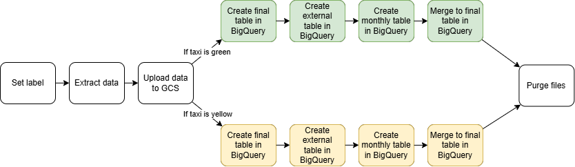

# ETL Pipelines on Google Cloud Platform and BigQuery

## Table of Contents
- [Understanding the Role of Google Cloud Storage and BigQuery](#understanding_the_role_of_google_cloud_storage_and_bigquery)
- [Initializing Google Cloud Storage and BigQuery](#initializing_google_cloud_storage_and_bigquery)
- [Workflow Overview](#workflow_overview)
- [Creating a Table in BigQuery](#creating_a_table_in_bigquery)
- [Staging Table for Data Loading](#staging_table_for_data_loading)
- [Merging Data into the Main Table](#merging_data_into_the_main_table)
- [Implementing Conditional Logic for Multiple Datasets](#implementing_conditional_logic_for_multiple_datasets)
- [Finalizing the Workflow](#finalizing_the_workflow)
- [Scheduling and Backfills ](#scheduling_and_backfills_)





Today, we will explore how to transition our existing **ETL pipeline** [Go to 09. ETL Pipelines with PostgreSQL, Orchestration](https://github.com/mfarhad1994/Data-Engineering-Projects/tree/main/09.%20ETL%20Pipelines%20with%20PostgreSQL%2C%20Orchestration) to **Google Cloud** using **Google Cloud Storage (GCS)** and **BigQuery**. To begin, we must first set up our environment on **Google Cloud** before integrating our pipeline, our objective is to extract data from a CSV file—similar to our previous **PostgreSQL** example—but instead of loading it into PostgreSQL, we will upload it to a **data lake**, specifically **Google Cloud Storage**. This serves as a staging area where the CSV file will be stored, ready for processing within Google Cloud.

Once the file is in **GCS**, **BigQuery** can automatically create a table from it, allowing us to start processing and querying the data. Our workflow remains similar to the previous approach: we maintain a staging table and a final table, merging monthly data into the main table for consolidated storage. However, the key difference here is that we leverage **cloud computing**, enabling us to process significantly larger datasets efficiently.

Additionally, we will incorporate a purge mechanism and later configure **scheduling** and **backfills**, as we did with PostgreSQL, to automate the workflow in the cloud. Let’s begin by setting up our Google Cloud environment.

## Understanding the Role of Google Cloud Storage and BigQuery

Google Cloud Storage (GCS) serves as an object storage solution, allowing us to store unstructured data, including images, PDFs, and other file formats typically found on a local computer. Additionally, structured data such as CSV files can also be stored in GCS, which we can later utilize in BigQuery—a cloud-based data warehouse designed for structured data storage and analysis. In essence, while GCS functions as a data lake, retaining raw source data, BigQuery enables structured processing and in-depth analysis. This workflow allows us to seamlessly transition data from GCS into BigQuery for further manipulation and insights.


## Initializing Google Cloud Storage and BigQuery

### Utilizing Key-value (KV) Store for Simplified Configuration

To streamline the process, we will use a **KV store**, which allows us to define key-value pairs akin to environment variables when coding locally. This enables seamless access to these values within our workflow, ensuring updates can be made dynamically without exposing them directly in the workflow itself.

Our next step is to gather essential Google Cloud credentials, such as a **service account** and **project ID**. In this case, we will be using the `farhad_mustafayev_cloud_proj` project. To configure access, we navigate to **IAM & Admin → Service Accounts**, where we generate a new service account. We then assign it appropriate roles:
-	**Storage Admin**, to manage GCS uploads
-	**BigQuery Admin**, to interact with BigQuery

Once the service account is created, we generate a JSON key, download it, and store its contents in the KV store.

This setup allows us to define critical variables programmatically, such as the **service account, project ID, bucket name, and dataset name**. These values will be stored in the KV store and dynamically retrieved during workflow execution.

```bash
id: gcp_kv
namespace: farhad_mustafayev_kestra_cloud

tasks:
  - id: gcp_project_id
    type: io.kestra.plugin.core.kv.Set
    key: GCP_PROJECT_ID
    kvType: STRING
    value: farhad_mustafayev_cloud_proj

  - id: gcp_location
    type: io.kestra.plugin.core.kv.Set
    key: GCP_LOCATION
    kvType: STRING
    value: europe-west3

  - id: gcp_bucket_name
    type: io.kestra.plugin.core.kv.Set
    key: GCP_BUCKET_NAME
    kvType: STRING
    value: kestraetlprobucket

  - id: gcp_dataset
    type: io.kestra.plugin.core.kv.Set
    key: GCP_DATASET
    kvType: STRING
    value: kestra_dataset
```

We also need to set the **project name, location, and the name of our Google Cloud Platform (GCP) bucket**. The bucket name must be unique. Additionally, I will set my dataset to `kestra_dataset`. When I execute this, all these values will be added to the **KV store**. Navigating to **"Namespaces"** and then to **"KV Store"**, we can confirm that these values are ready for use in our subsequent workflows.

Now, moving on to the setup task, it will initialize the bucket name and dataset. By leveraging the values we've already specified, it will dynamically generate the required configurations.


```bash
id: gcp_setup
namespace: farhad_mustafayev_kestra_cloud

tasks:
  - id: create_gcs_bucket
    type: io.kestra.plugin.gcp.gcs.CreateBucket
    ifExists: SKIP
    storageClass: REGIONAL
    name: "{{kv('GCP_BUCKET_NAME')}}" 

  - id: create_bq_dataset
    type: io.kestra.plugin.gcp.bigquery.CreateDataset
    name: "{{kv('GCP_DATASET')}}"
    ifExists: SKIP

pluginDefaults:
  - type: io.kestra.plugin.gcp
    values:
      serviceAccount: "{{kv('GCP_CREDS')}}"
      projectId: "{{kv('GCP_PROJECT_ID')}}"
      location: "{{kv('GCP_LOCATION')}}"
      bucket: "{{kv('GCP_BUCKET_NAME')}}"
```

Let's proceed with execution and observe how everything integrates into Google Cloud. The system will create the bucket using the provided information and establish the dataset. Upon refreshing the Google Cloud console, we should see the newly created bucket. Similarly, refreshing BigQuery will reveal the presence of a new dataset named `kestraetlprobucket`, confirming that our Google Cloud environment is fully set up and operational.


## Workflow Overview

Let's examine the workflow step by step to understand its components and how it can be adapted for our specific use case.

```bash
inputs:
  - id: taxi
    type: SELECT
    displayName: Select taxi type
    values: [yellow, green]
    defaults: green

  - id: year
    type: SELECT
    displayName: Select year
    values: ["2019", "2020"]
    defaults: "2019"
    allowCustomValue: true 

  - id: month
    type: SELECT
    displayName: Select month
    values: ["01", "02", "03", "04", "05", "06", "07", "08", "09", "10", "11", "12"]
    defaults: "01"
```

Now we're going to again generate those dynamic **variables** here that are using expressions here to generate different values.

```bash
variables:
  file: "{{inputs.taxi}}_tripdata_{{inputs.year}}-{{inputs.month}}.csv"
  gcs_file: "gs://{{kv('GCP_BUCKET_NAME')}}/{{vars.file}}"
  table: "{{kv('GCP_DATASET')}}.{{inputs.taxi}}_tripdata_{{inputs.year}}_{{inputs.month}}"
  data: "{{outputs.extract.outputFiles[inputs.taxi ~ '_tripdata_' ~ inputs.year ~ '-' ~ inputs.month ~ '.csv']}}"
```

Then we can see here that we have got an extract to pull the data from GitHub.

```bash
  - id: extract
    type: io.kestra.plugin.scripts.shell.Commands
    outputFiles:
      - "*.csv"
    taskRunner:
      type: io.kestra.plugin.core.runner.Process
    commands:
      - wget -qO- https://github.com/DataTalksClub/nyc-tlc-data/releases/download/{{inputs.taxi}}/{{render(vars.file)}}.gz | gunzip > {{render(vars.file)}}
```

Data Extraction and Storage:
-	The first step involves extracting the data from GitHub.
-	Once extracted, the CSV file is uploaded to our data lake (GCS).

```bash
  - id: upload_to_gcs
    type: io.kestra.plugin.gcp.gcs.Upload
    from: "{{render(vars.data)}}"
    to: "{{render(vars.gcs_file)}}"
```

At this point, executing the workflow with an example input—such as Green Taxi, January 2019—will result in the CSV file being uploaded to GCS. This can be verified within the **Google Cloud Platform**. The next step involves transferring this data to **BigQuery**.

## Creating a Table in BigQuery

To process the CSV file in **BigQuery**, we need to create a table. This process is similar to setting up a table in PostgreSQL but involves defining a schema that aligns with our CSV data.

-	We define a main table where multiple CSV files will be merged.
-	The schema includes key attributes such as a `unique_row_id`, `filename`, and other fields present in the CSV.
-	The data types for each field are referenced from the BigQuery documentation.

```bash
      - id: bq_green_tripdata
        type: io.kestra.plugin.gcp.bigquery.Query
        sql: |
          CREATE TABLE IF NOT EXISTS `{{kv('GCP_PROJECT_ID')}}.{{kv('GCP_DATASET')}}.green_tripdata`
          (unique_row_id BYTES OPTIONS, filename STRING OPTIONS, VendorID STRING OPTIONS, lpep_pickup_datetime TIMESTAMP OPTIONS, lpep_dropoff_datetime TIMESTAMP OPTIONS, store_and_fwd_flag STRING OPTIONS, RatecodeID STRING OPTIONS, PULocationID STRING OPTIONS, DOLocationID STRING OPTIONS, passenger_count INT64 OPTIONS, trip_distance NUMERIC OPTIONS, fare_amount NUMERIC OPTIONS, extra NUMERIC OPTIONS, mta_tax NUMERIC OPTIONS, tip_amount NUMERIC OPTIONS, tolls_amount NUMERIC OPTIONS, ehail_fee NUMERIC, improvement_surcharge NUMERIC OPTIONS, total_amount NUMERIC OPTIONS, payment_type INTEGER OPTIONS, trip_type STRING OPTIONS, congestion_surcharge NUMERIC OPTIONS 
          )
          PARTITION BY DATE(lpep_pickup_datetime);
```

Upon execution, the workflow:
1.	Uploads the file to GCS.
2.	Creates a new table in BigQuery based on the predefined schema.

Refreshing BigQuery will confirm the creation of a new table, green_tripdata, within our dataset.

## Staging Table for Data Loading

Before merging data into the main table, we first load it into a staging table—a temporary storage space. 

```bash
      - id: bq_green_table_ext
        type: io.kestra.plugin.gcp.bigquery.Query
        sql: |
          CREATE OR REPLACE EXTERNAL TABLE `{{kv('GCP_PROJECT_ID')}}.{{render(vars.table)}}_ext`
          ( VendorID STRING OPTIONS , lpep_pickup_datetime TIMESTAMP OPTIONS , lpep_dropoff_datetime TIMESTAMP OPTIONS , store_and_fwd_flag STRING OPTIONS , RatecodeID STRING OPTIONS , PULocationID STRING OPTIONS , DOLocationID STRING OPTIONS , passenger_count INT64 OPTIONS , trip_distance NUMERIC OPTIONS , fare_amount NUMERIC OPTIONS , extra NUMERIC OPTIONS , mta_tax NUMERIC OPTIONS , tip_amount NUMERIC OPTIONS , tolls_amount NUMERIC OPTIONS , ehail_fee NUMERIC, improvement_surcharge NUMERIC OPTIONS , total_amount NUMERIC OPTIONS , payment_type INTEGER OPTIONS , trip_type STRING OPTIONS , congestion_surcharge NUMERIC OPTIONS 
          )
          OPTIONS (
              format = 'CSV',
              uris = ['{{render(vars.gcs_file)}}'],
              skip_leading_rows = 1,
              ignore_unknown_values = TRUE
          );
```

This intermediate table lacks attributes like `unique_row_IDs` and `filenames`, ensuring that it exactly mirrors the CSV file structure.
The process involves:
1.	Loading the CSV file into the staging table.
2.	Adding unique attributes (such as a `unique_row_ID` and `filename`) within BigQuery.
3.	Merging the staged data into the main table.
Since the data is already present in GCS, no additional uploads are required. Upon execution, we can verify that both the staging and main tables exist in BigQuery, with data correctly mapped. The staging table serves as a bridge, ensuring proper structuring before integration into the main dataset.

## Merging Data into the Main Table

The next step involves merging the newly processed data into green_tripdata. This task:
-	Generates a unique identifier using specific column values.
-	Ensures duplicate records are not introduced in future uploads.
-	Incorporates the file name attribute for traceability.

```bash
      - id: bq_green_table_tmp
        type: io.kestra.plugin.gcp.bigquery.Query
        sql: |
          CREATE OR REPLACE TABLE `{{kv('GCP_PROJECT_ID')}}.{{render(vars.table)}}`
          AS
          SELECT
            MD5(CONCAT(
              COALESCE(CAST(VendorID AS STRING), ""),
              COALESCE(CAST(lpep_pickup_datetime AS STRING), ""),
              COALESCE(CAST(lpep_dropoff_datetime AS STRING), ""),
              COALESCE(CAST(PULocationID AS STRING), ""),
              COALESCE(CAST(DOLocationID AS STRING), "")
            )) AS unique_row_id,
            "{{render(vars.file)}}" AS filename,
            *
          FROM `{{kv('GCP_PROJECT_ID')}}.{{render(vars.table)}}_ext`;
```

Upon execution, the temporary table is updated with these new values. Refreshing BigQuery will reveal the presence of additional columns—confirming the enhancement of our dataset.

Now, the workflow merges this enriched data into green_tripdata, eliminating redundant tables such as green_tripdata_2019_01 and green_tripdata_2019_01_ext.


## Implementing Conditional Logic for Multiple Datasets

To accommodate both green and yellow taxi datasets—each with a slightly different schema—conditional logic is introduced into the workflow.

```bash
  - id: if_green_taxi
    type: io.kestra.plugin.core.flow.If
    condition: "{{inputs.taxi == 'green'}}"
    then:

  - id: if_yellow_taxi
    type: io.kestra.plugin.core.flow.If
    condition: "{{inputs.taxi == 'yellow'}}"
    then:
```


## Finalizing the Workflow

The final step involves merging the project ID and dataset for green_tripdata, ensuring alignment with the staged dataset containing the unique values.
Executing this step consolidates all structured data within the main table. 

```bash
      - id: bq_green_merge
        type: io.kestra.plugin.gcp.bigquery.Query
        sql: |
          MERGE INTO `{{kv('GCP_PROJECT_ID')}}.{{kv('GCP_DATASET')}}.green_tripdata` T
          USING `{{kv('GCP_PROJECT_ID')}}.{{render(vars.table)}}` S
          ON T.unique_row_id = S.unique_row_id
          WHEN NOT MATCHED THEN
            INSERT (unique_row_id, filename, VendorID, lpep_pickup_datetime, lpep_dropoff_datetime, store_and_fwd_flag, RatecodeID, PULocationID, DOLocationID, passenger_count, trip_distance, fare_amount, extra, mta_tax, tip_amount, tolls_amount, ehail_fee, improvement_surcharge, total_amount, payment_type, trip_type, congestion_surcharge)
            VALUES (S.unique_row_id, S.filename, S.VendorID, S.lpep_pickup_datetime, S.lpep_dropoff_datetime, S.store_and_fwd_flag, S.RatecodeID, S.PULocationID, S.DOLocationID, S.passenger_count, S.trip_distance, S.fare_amount, S.extra, S.mta_tax, S.tip_amount, S.tolls_amount, S.ehail_fee, S.improvement_surcharge, S.total_amount, S.payment_type, S.trip_type, S.congestion_surcharge);
```


Refreshing BigQuery will confirm the successful integration of the January dataset. If the workflow is rerun for February, the dataset will be updated accordingly—without duplication.

This structured approach ensures seamless data ingestion, transformation, and storage within Google Cloud while maintaining efficiency and data integrity:

-	The workflow first extracts data from GitHub and uploads it to GCS.
-	It then evaluates whether the process applies to yellow taxis. 
    - If true, it executes the corresponding BigQuery tasks.
    -	If false, it proceeds to check for green taxis and processes them accordingly.
-	Upon completion, the system purges unnecessary CSV files from Kestra executions to prevent excessive storage consumption.

The steps that have not been mentioned here are the same as [Go to 09. ETL Pipelines with PostgreSQL, Orchestration](https://github.com/mfarhad1994/Data-Engineering-Projects/tree/main/09.%20ETL%20Pipelines%20with%20PostgreSQL%2C%20Orchestration).

# Scheduling and Backfills 

We will explore how to integrate scheduling into our **BigQuery** workflow and subsequently perform backfills for data from 2019. Previously, our workflow allowed users to manually select dates using an input mechanism, enabling the selection of years (2019 and 2020) and corresponding months via a dropdown menu. However, we are now replacing this manual selection with an automated trigger that will handle both the green and yellow datasets, ensuring seamless execution. Additionally, we will perform backfills to retroactively populate missing data for previous months.

To achieve this, we introduce a slightly modified workflow that incorporates the necessary **trigger**.

```bash
triggers:
  - id: green_schedule
    type: io.kestra.plugin.core.trigger.Schedule
    cron: "0 9 1 * *"
    inputs:
      taxi: green

  - id: yellow_schedule
    type: io.kestra.plugin.core.trigger.Schedule
    cron: "0 10 1 * *"
    inputs:
      taxi: yellow
```

Navigating to the Triggers section in Kestra, we can see that the workflows are scheduled to run at specific times: the green dataset is processed at 9:00 AM, followed by the yellow dataset at 10:00 AM. These executions occur on the first of each month, as the data is generated on a monthly basis.

Our approach remains largely consistent with previous iterations. We will set execution labels to track the processed files, extract data from GitHub, and upload it to a **Google Cloud Storage (GCS) data lake**, where **BigQuery** will automatically ingest the data. The core structure of the workflow remains unchanged, including the conditional processing blocks for the green and yellow datasets, followed by a file purge operation. The primary modification lies in the expressions within the variables—where previously we relied on manually provided inputs (e.g., month/year), we now leverage the trigger mechanism for automation.

```bash
variables:
  file: "{{inputs.taxi}}_tripdata_{{trigger.date | date('yyyy-MM')}}.csv"
  gcs_file: "gs://{{kv('GCP_BUCKET_NAME')}}/{{vars.file}}"
  table: "{{kv('GCP_DATASET')}}.{{inputs.taxi}}_tripdata_{{trigger.date | date('yyyy_MM')}}"
  data: "{{outputs.extract.outputFiles[inputs.taxi ~ '_tripdata_' ~ (trigger.date | date('yyyy-MM')) ~ '.csv']}}"
```

This automated approach means that executing the workflow manually will no longer work as expected, since the required date parameters will not be explicitly provided. While more advanced expressions could be implemented to enable manual execution, our focus today is on utilizing backfills, which is the most effective solution in this context.

By accessing the **Triggers** section in Kestra, we can execute backfills for both the green and yellow datasets. For instance, selecting yellow as the dataset type allows us to backfill data for the entirety of 2019. After initiating the backfill, we can label the execution accordingly to indicate that it is a historical data retrieval process. This ensures clarity when reviewing past executions.

Upon executing the backfill and refreshing our storage bucket, we should observe 12 CSV files successfully uploaded, corresponding to the full year's data.
