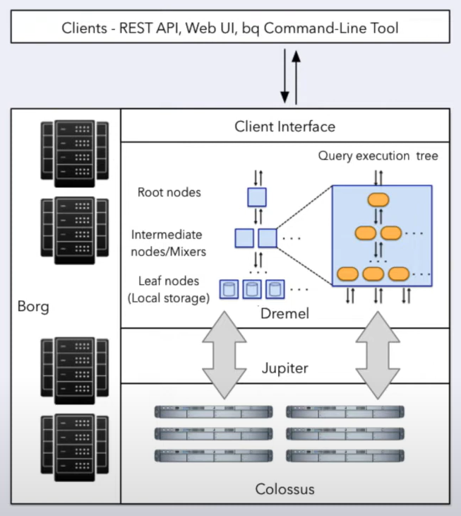
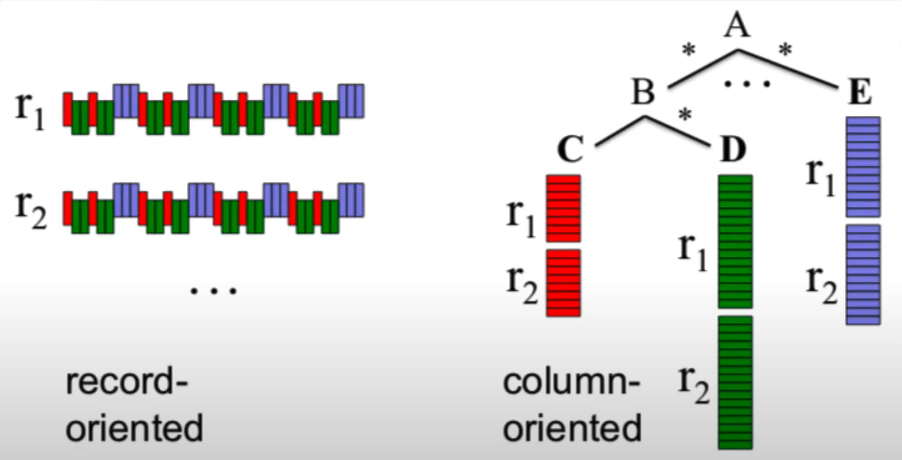
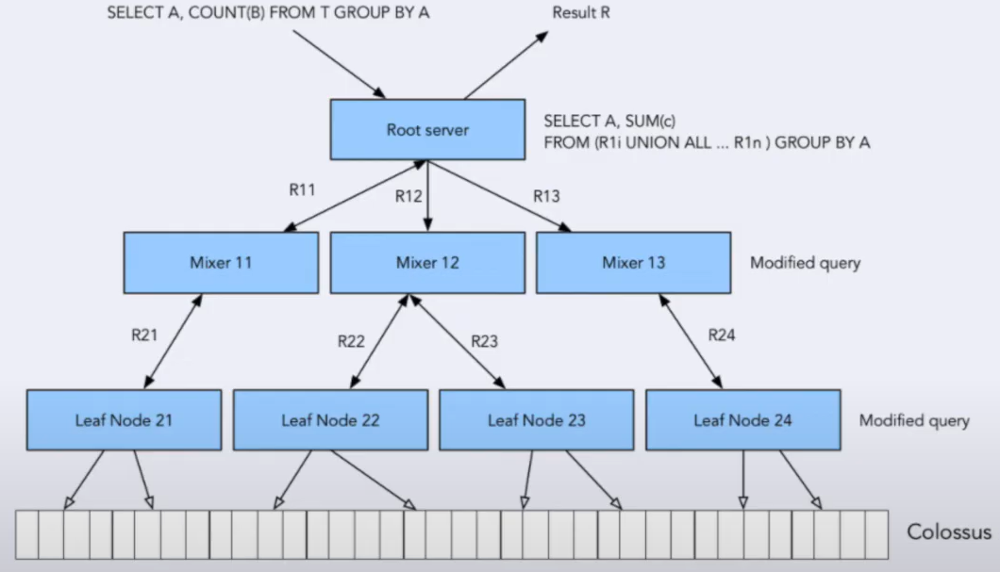

## Table of Contents
- [Understanding Data Warehouses: OLAP vs. OLTP, BigQuery, and Best Practices](#understanding_data_warehouses:_olap_vs._oltp,_bigquery,_and_best_practices)
- [Partitioning and Clustering in BigQuery](#partitioning_and_clustering_in_bigquery)
- [Best Practices for Cost Reduction](#best_practices_for_cost_reduction)
- [Understanding the Internals of BigQuery](#understanding_the_internals_of_bigquery)


# Understanding Data Warehouses: OLAP vs. OLTP, BigQuery, and Best Practices


In this discussion, we will explore data warehouses in depth, covering fundamental concepts such as OLAP vs. OLTP, the definition of a data warehouse, and BigQuery’s capabilities, partitioning, clustering, best practices and internal workings. Let’s begin with a comparison of OLAP (Online Analytical Processing) and OLTP (Online Transaction Processing).

### OLAP vs. OLTP: Key Differences and Use Cases

What is OLTP?
OLTP, or Online Transaction Processing, is designed for handling real-time transactional workloads. It is commonly used in backend services where multiple SQL queries need to be executed as a unit, ensuring atomicity—meaning that if one query fails, all queries in the transaction can be rolled back to maintain data consistency.

What is OLAP?
OLAP, or Online Analytical Processing, serves a different purpose. It is optimized for handling large-scale data analysis, enabling users to discover insights from massive datasets. OLAP databases are predominantly used by data analysts and data scientists for complex analytical queries.


### Comparison of OLTP and OLAP

| Aspect   | OLTP (Online Transaction Processing) | OLAP (Online Analytical Processing) |
|--------|-----|---------|	
| Use Case | Transactional systems, e.g., banking, e-commerce |	Analytical processing, e.g., reporting, business intelligence  |
| Data Updates | Frequent, small, and real-time updates | Periodic batch updates with large datasets |
| Database Design |	Normalized schema for efficiency |	Denormalized schema for faster querying |
| Performance Focus	| Optimized for fast transactions |	Optimized for complex query performance |
| End Users |	Customer-facing applications, online shopping, backend databases |	Business analysts, data scientists, executives |
| Productivity Gains |	Improves end-user experience and system efficiency | Enhances analytical productivity for decision-makers |

### What is a Data Warehouse?

A data warehouse is an OLAP-based solution used for reporting and data analysis. As illustrated in the architecture diagram, a typical data warehouse consists of three main components:
1.	Raw Data – The unprocessed source data.
2.	Metadata – Information about the data’s structure and meaning.
3.	Summary Data – Pre-aggregated data for efficient querying.

### Data Warehouse Architecture

Data warehouses consolidate information from various sources, including:
-	Operating Systems
-	Flat file storage systems
-	OLTP Databases
These data sources report to a staging area, where data is cleansed, transformed, and stored in the warehouse. From the data warehouse, structured subsets of data—known as data marts—are created. These data marts can focus on specific business areas such as purchasing, sales, and inventory.

### Accessing Data in a Data Warehouse

-	Data analysts typically interact with data marts for domain-specific insights.
-	Data scientists often work with raw data directly to develop models and uncover deeper patterns.
-	Executives use summarized data for strategic decision-making.

Regardless of the use case, a data warehouse provides direct access to raw data, summarized data, and specialized data marts.


BigQuery is a fully-managed, serverless data warehouse that eliminates the need for managing servers or installing database software.

### Advantages of BigQuery

-	Minimal Setup & Maintenance – Unlike traditional data warehouses, BigQuery eliminates the overhead of provisioning and managing infrastructure.
-	Scalability – Start with a few gigabytes of data and scale seamlessly to petabyte-level workloads.
-	Built-in Machine Learning (ML) – Execute ML models directly using SQL, without requiring additional ML infrastructure.
-	Geospatial Data Handling – Efficiently process location-based datasets.
-	Business Intelligence (BI) Queries – Perform complex aggregations, filters, and transformations efficiently.

### Cost Optimization in BigQuery

One of BigQuery’s standout features is its cost-efficient storage and compute model.
-	Traditional databases combine storage and compute, requiring an increase in machine capacity as data grows.
-	BigQuery decouples storage and compute, allowing businesses to store data separately while dynamically scaling query execution as needed.

# Partitioning and Clustering in BigQuery

Partitioning helps improve query performance and cost efficiency by dividing a large dataset into smaller, manageable segments. Common partitioning strategies include:
-	Time-based partitioning (e.g., daily, monthly, yearly)
-	Integer-based partitioning (e.g., user ID ranges)
-	Ingestion-time partitioning (automatic partitioning based on data arrival time)

Querying a partitioned dataset using the partitioned column significantly reduces query costs.

Clustering further optimizes data retrieval by grouping similar records within partitions. This enhances query speed by reducing the amount of scanned data, making it ideal for large-scale analytical workloads.


### Understanding Partitioning 

When creating a partitioned table in BigQuery, you can choose from the following partitioning strategies:
-	Time Unit Column Partitioning: Partitions data based on a timestamp or date column.
-	Ingestion Time Partitioning: Partitions data based on when it was loaded into BigQuery.
-	Integer Range Partitioning: Partitions data based on a predefined integer range.

For time-based partitioning, users can select from daily, hourly, monthly, or yearly partitions:
-	Daily Partitioning (Default): Suitable for medium-sized datasets evenly distributed across days.
-	Hourly Partitioning: Used for high-frequency data ingestion and processing at an hourly level. However, since BigQuery enforces a limit of 4,000 partitions per table, an expiration strategy should be considered to avoid excessive partition creation.
-	Monthly/Yearly Partitioning: Best suited for small datasets spread across broader time ranges.


### Clustering in BigQuery

In BigQuery, clustering ensures that the specified clustering columns are co-located, improving query performance. The order of clustering columns is crucial, as it dictates the sorting hierarchy:
-	For example, if clustering is applied on columns A, B, and C, data will be sorted primarily by column A, followed by B, and finally C.

Clustering enhances the efficiency of filter and aggregate queries, particularly when these operations are performed on clustered columns. However, clustering and partitioning may not be beneficial for small datasets (under 1GB) due to the additional cost incurred by metadata reads and maintenance.

Clustering Constraints:
-	A table can have up to four clustering columns.
-	Clustering columns must be top-level and non-repeated fields.
-	The supported clustering column data types include:
    -	DATE, BOOLEAN, GEOGRAPHY, INT64, NUMERIC, BIGNUMERIC, STRING, TIMESTAMP, and DATETIME.

### Comparing Partitioning and Clustering

There are scenarios where you must decide between partitioning, clustering, or a combination of both. Understanding the differences is key to optimizing query performance and cost:

| Feature |	Partitioning |	Clustering
|--------|-----|---------|	
| Cost Predictability |	Cost benefits are known upfront. |	Cost benefits are less predictable. |
| Query Cost Control |	Enables query cost constraints based on partition pruning. |	Cannot enforce strict cost limits. |
| Granularity |	Best for filtering on a single high-level column. |	Suitable when filtering or aggregating across multiple columns.|
| Partition Management |	Allows deletion, creation, and storage migration of partitions. |	Clustering does not support partition-level management. |
| Cardinality Considerations |	Limited to 4,000 partitions per table. |	Handles high-cardinality datasets more efficiently. |

### When to Choose Clustering Over Partitioning

Clustering should be preferred in cases where:
-	Partitions result in small partition sizes (<1GB).
-	Partitioning exceeds the 4,000 partition limit.
-	Frequent modifications affect multiple partitions, leading to increased storage overhead and maintenance.


For example, if data ingestion happens hourly, modifying all partitions frequently might be inefficient. In such cases, clustering offers a more effective solution.

### Automatic Clustering in BigQuery

BigQuery provides an automatic clustering feature, which dynamically maintains clustering properties as data is inserted. However, newly inserted data is initially stored in separate blocks, leading to key range overlaps that may degrade query performance. To counteract this, BigQuery performs automatic re-clustering in the background without any manual intervention.

Key Aspects of Automatic Clustering:
-	Maintains sorting properties within clustered tables.
-	Runs seamlessly in the background, with no impact on query performance.
-	Applies to partitioned tables (clustering is managed within each partition).
-	Does not incur additional costs for end users.

By leveraging partitioning and clustering appropriately, users can significantly optimize query performance, minimize costs, and enhance data retrieval efficiency in BigQuery.


# Best Practices for Cost Reduction

1. Avoid Using SELECT *:

When querying a table, always specify the required column names instead of using SELECT *. BigQuery utilizes columnar storage, meaning data retrieval is optimized when only the necessary columns are queried. Using SELECT * results in reading all columns, which increases data processing costs and query execution time.

2. Estimate Query Costs Before Execution:

Before running a query, always review its estimated cost, which is displayed in the top-right corner of the BigQuery console. This practice helps in avoiding unnecessary expenses, especially when working with large datasets.

3. Use Partitioned and Clustered Tables:

Partitioning and clustering are effective techniques for optimizing query performance and reducing costs. Partitioning allows for efficient data pruning, while clustering reduces scan operations. We have previously discussed these techniques in detail.

4. Use Streaming Inserts with Caution:

While streaming inserts provide real-time data ingestion, they can significantly increase costs due to additional processing overhead. Consider using batch loading whenever possible, as it is more cost-effective.

5. Materialize Query Results in Stages:

Instead of repeatedly computing the same intermediate results, consider materializing query results at different stages. If a Common Table Expression (CTE) is used in multiple places, it may be beneficial to materialize the results beforehand to improve efficiency.

6. Leverage BigQuery’s Query Result Caching:

BigQuery automatically caches query results for 24 hours, allowing repeated queries to be executed at a lower cost. Reusing cached results can significantly reduce compute expenses.

## Best Practices for Query Performance Optimization

1. Filter on Partitioned or Clustered Columns:

Whenever possible, apply filters to partitioned or clustered columns. This ensures that only relevant subsets of data are processed, thereby minimizing query execution time.

2. Denormalize Data Where Feasible:

Instead of relying heavily on normalized relational models, consider denormalization using nested or repeated columns. This approach can reduce join operations and improve query performance by minimizing data shuffling.

3. Minimize Use of External Data Sources:

Reading data from Google Cloud Storage or other external sources can increase query latency and costs. Where possible, import data into BigQuery tables before performing intensive queries.

4. Reduce Data Before Performing Joins:

Filtering or aggregating data before executing a JOIN operation helps in reducing the data volume involved in the join, leading to faster performance.

5. Avoid Treating WITH Clauses as Prepared Statements:

Common Table Expressions (WITH clauses) are recomputed each time they are referenced in a query. If the same result is needed multiple times, consider materializing intermediate results instead of relying on WITH clauses.

6. Prevent Oversharding of Tables:

Excessively sharding tables (splitting them into too many small partitions) can lead to inefficient data retrieval. Balance the number of partitions to avoid unnecessary performance bottlenecks.

7. Avoid Using JavaScript and User-Defined Functions (UDFs):

JavaScript-based UDFs introduce additional processing overhead, often making queries slower. Whenever possible, use built-in SQL functions for better performance.

8. Use Approximate Aggregation Functions:

For large-scale analytics, use approximate aggregation functions like HyperLogLog++ instead of exact calculations. These functions trade minimal accuracy loss for substantial performance gains.

9. Ensure ORDER BY is the Last Operation:

Sorting operations can be computationally expensive. To maximize performance, ensure that the ORDER BY clause is executed only after all filtering and aggregation operations are complete.

10. Optimize Join Patterns:

The order in which tables are joined can significantly impact performance. As a best practice:
-	Place the largest table first, as it gets evenly distributed across nodes.
-	Follow it with smaller tables (starting with the table having the fewest rows).
-	Arrange the remaining tables in descending order of size.

This approach ensures optimal resource allocation and minimizes unnecessary data movement.


# Understanding the Internals of BigQuery


To effectively utilize BigQuery, an in-depth understanding of its internal architecture is not strictly necessary. By following best practices such as clustering and partitioning, users can efficiently run queries and manage data without delving into its underlying mechanisms. However, acquiring knowledge about BigQuery’s internals can be highly beneficial, especially when developing scalable data products. A deeper comprehension of data warehouse solutions like BigQuery enhances one's ability to optimize performance, reduce costs, and build robust data-driven applications in the future.

### BigQuery’s Storage Architecture: Colossus




BigQuery utilizes Colossus, a specialized distributed storage system, to manage its data. Colossus offers cost-effective, columnar storage, which provides significant advantages:
-	Separation of storage and compute: Unlike traditional databases, BigQuery keeps storage and computation independent, resulting in a lower overall cost. Users primarily pay for compute resources when executing queries, while data storage remains relatively inexpensive.
-	Scalability: As data volumes grow, users only pay for additional storage, which is considerably cheaper compared to increasing computational resources.
-	Efficient Data Retrieval: Since BigQuery stores data in a columnar format, it can scan only the required columns during query execution, reducing processing time and cost.

Despite these advantages, separating compute from storage presents a key challenge: How do compute nodes efficiently access data stored separately? If network performance is inadequate, query execution times can be significantly impacted. This is where Jupiter Network plays a critical role.


### High-Speed Networking: The Role of Jupiter Network

To mitigate potential network latency, BigQuery employs the Jupiter Network, an ultra-fast networking infrastructure within Google’s data centers. This network provides an astonishing 1 terabyte per second (TBps) bandwidth, enabling seamless and near-instantaneous communication between compute and storage nodes.

The benefits of Jupiter Network include:

-	Eliminating delays in data retrieval from Colossus to compute nodes.
-	Supporting large-scale parallel processing without bottlenecks.
-	Enhancing BigQuery’s scalability and responsiveness for complex analytical workloads.

By leveraging the Jupiter Network, BigQuery effectively overcomes the limitations of distributed storage and ensures high-speed query execution.


### Query Execution in BigQuery: The Dremel Engine

BigQuery's execution engine, Dremel, is responsible for processing SQL queries efficiently. Dremel employs a tree-based architecture to break queries into smaller components, enabling massive parallel execution across multiple nodes.

How Dremel Works:
1.	Query Parsing and Optimization: When a user submits a query, BigQuery’s root server interprets it and restructures it into optimized subqueries.
2.	Query Distribution:
    -	The root server distributes query fragments to mixers, which further divide tasks into leaf nodes.
    -	Each leaf node interacts directly with Colossus storage, retrieving the required data and performing initial processing.
3.	Aggregation and Result Compilation:
    -	Processed data is returned to mixers, where intermediate aggregations occur.
    -	Mixers then transmit the aggregated results back to the root server, which compiles and returns the final output to the user.

This distributed execution model allows BigQuery to efficiently process enormous datasets, ensuring low latency and high throughput.

### Column-Oriented vs. Record-Oriented Storage



Understanding how data is stored plays a crucial role in optimizing query performance. Traditional databases use record-oriented (row-based) storage, where data is stored sequentially for each row. In contrast, BigQuery leverages column-oriented storage, which provides several advantages:
-	Faster Aggregations: Since data is stored column-wise, BigQuery can efficiently scan only the necessary columns, significantly improving aggregation operations.
-	Optimized Query Performance: Most analytical queries do not require all columns; they typically filter and aggregate data across a subset of columns.
-	Reduced I/O Overhead: By retrieving only the required columns, BigQuery minimizes data transfer and speeds up query execution.

This architecture aligns perfectly with data warehouse workloads, where analytical queries focus on aggregations and filtering rather than transactional row-based retrievals.

### Step-by-Step Execution of a BigQuery Query

To illustrate how Dremel processes a query, consider the following SQL statement:
```bash
SELECT A, COUNT(B) FROM your_table T GROUP BY A;
```



Query Execution Breakdown:
1.	Query Parsing:
    -	The root server receives the query and rewrites it as: SELECT A, SUM(C)
    - 	The query is then divided into smaller components: R1 to Rn.
2.	Query Distribution:
    -	Mixers receive the optimized subqueries and further divide them into smaller execution units.
    -	Leaf nodes retrieve data from Colossus and perform local computations.
3.	Parallel Processing at Leaf Nodes:
    -	Each leaf node executes its assigned operations (e.g., filtering, aggregation) on its respective data partition.
    -	Results are passed back to mixers for higher-level aggregations.
4.	Final Aggregation and Result Compilation:
    -	Mixers aggregate the results from multiple leaf nodes and send them to the root server.
    -	The final aggregated output is returned to the user.
This highly distributed approach enables BigQuery to scale effortlessly, handling vast datasets with minimal query latency.

### Why BigQuery is Exceptionally Fast

Several architectural choices contribute to BigQuery’s unparalleled performance:
1.	Distributed Query Execution: Queries are automatically partitioned and processed in parallel across multiple nodes.
2.	Columnar Storage Format: Reduces unnecessary data scans and improves aggregation performance.
3.	High-Speed Networking (Jupiter Network): Ensures seamless communication between compute and storage nodes with low latency.
4.	Efficient Query Optimization: Dremel restructures queries dynamically, ensuring optimal execution plans.
5.	Separation of Compute and Storage: Allows independent scaling of resources based on workload requirements.

By leveraging these design principles, BigQuery provides high-performance analytical querying at an optimal cost, making it a powerful choice for data-intensive applications.
